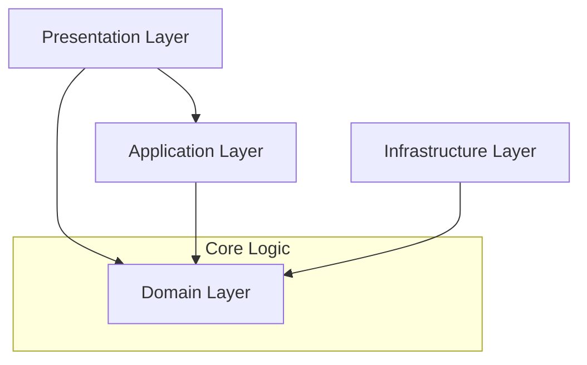

# Feature Structure Documentation

Đây là cấu trúc chuẩn cho một Feature trong dự án, áp dụng kiến trúc **Clean Architecture** kết hợp với **Feature-First**.

## Sơ đồ kiến trúc (Dependency Rule)

> **Nguyên tắc quan trọng**: `Domain Layer` ở trung tâm và không được phụ thuộc vào bất kỳ layer nào khác.

## Các thành phần

Mỗi feature được chia thành các layer rõ ràng:

1.  **[Presentation](presentation/presentation.md)**
    *   Chứa UI (Pages, Widgets).
    *   Nhận input từ user và hiển thị data.
    
2.  **[Application](application/application.md)**
    *   State Management (Bloc/Cubit).
    *   Điều phối logic giữa UI và Domain.
    
3.  **[Domain](domain/domain.md)**
    *   **Lõi của Feature**.
    *   Chứa Entities, Value Objects, Failures.
    *   Định nghĩa Repository Interfaces (Contracts).
    
4.  **[Infrastructure](infrastructure/infrastructure.md)**
    *   Triển khai (Implement) Repository Interfaces.
    *   Gọi API, Database local.
    *   Chuyển đổi data models (DTOs).

5.  **[Core](core/core.md)**
    *   Các tiện ích (Utils, Extensions) dùng riêng cho feature này.

## Luồng dữ liệu (Data Flow)

1.  **UI** gửi Event -> **Application** (Bloc).
2.  **Bloc** gọi **Domain** (UseCase/Repository Interface).
3.  **Infrastructure** (Repository Impl) thực hiện lấy data, trả về **Entity** hoặc **Failure**.
4.  **Bloc** nhận kết quả, emit **State** mới.
5.  **UI** rebuild theo **State**.
